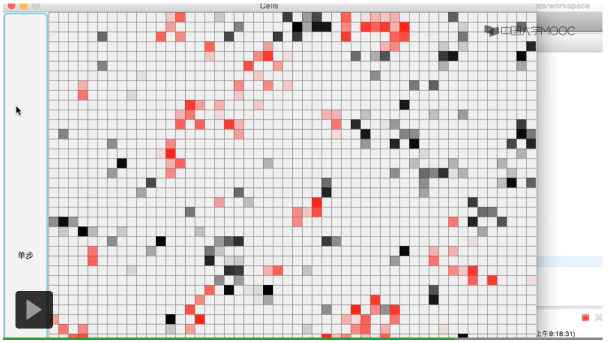

## 7.1控制反转

Java Swing类中特殊的功能：布局管理器：BorderLaysout

frame.add(btnStep,BorderLayout.NORTH);

frame.add(btnStep,BorderLayout.WEST);结果如图所示将按钮放在west的位置

（bunStep是按钮类的一个对象）

将按钮放在东西南北（NORTH,SOUTH,WEST,EAST）和中心(CENTER)的某一个地方。

BorderLayout会把容器分成如图所示的样子：

