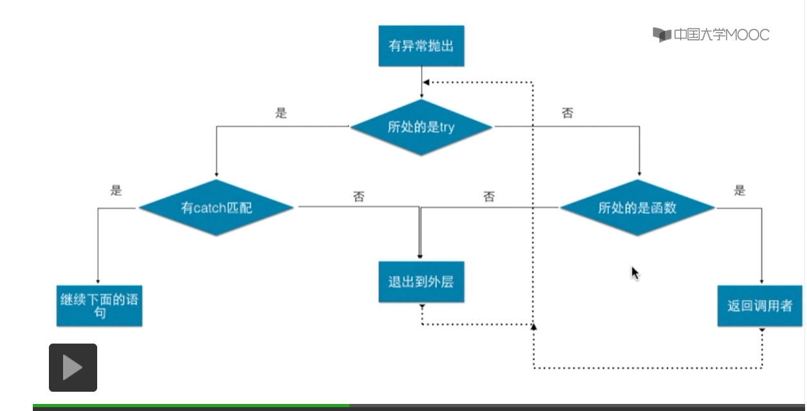

## 8.1异常

### try... catch语句

```java
try{

}catch(){

}
```

捕捉异常的大致流程：



### 再度抛出异常用throw语句

```java
catch(Exception e){

System.err.println("An exception was thrown");

throw e;

}


```

如果在这个层面上需要处理，但不能做最终的决定

