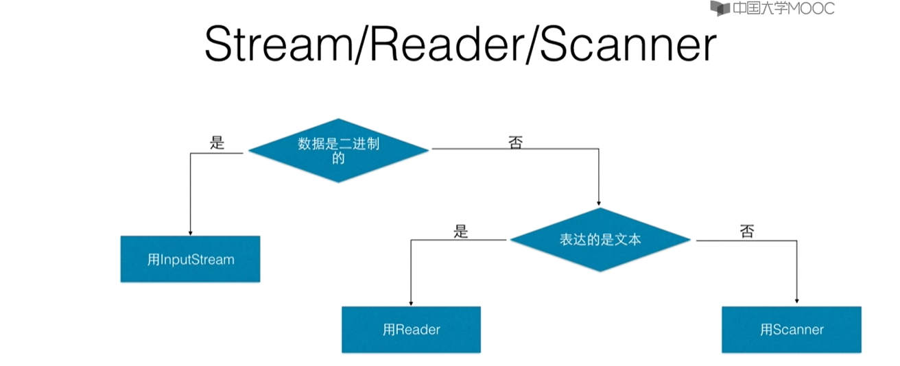

## 8.4文本输入输出

### Reader/Writer

二进制数据采用`InputStream/OutputStream`

文本数据采用`Reader/Writer`是处理Unicode的，我们需要借助Stream打开那个文件然后在此基础上以过滤器的方式建立`Reader/Writer`，来作文本上的输入输出

### 在流上建立文本处理

```java
PrintWriter pw = new PrintWriter(
 new BufferedWriter(
     new OutputStreamWriter(
     new FileOutputStream("abc.txt"))) );
```

### Reader

常用的是BufferedReader

readLine

### LineNumberReader

可以得到行号

   getLineNumber()

### FileReader

InputStreamReader类的子类，所有方法都从父类中继承而来

FileReader(File file )

​      在给定从中读取数据的File的情况下创建一个新的FileReader.

FileReader(String fileName)

  在给定从中读取数据的文件名的情况下创建一个新的FileReader

​          FileReader不能指定编码转换方式

### 格式化输入输出

#### 什么时候用Stream/Reader/Scanner

